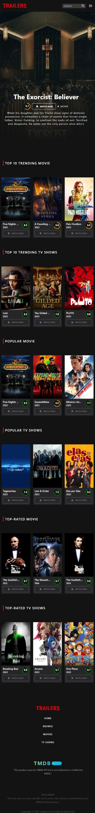

<h2>About the project ❓</h2>

  
Trailers is a movie app where you can watch trending, popular, top-rated, and upcoming Movie/TV shows.

👉 Live Demo: <a href='https://trailers-alpha.vercel.app/'>Live Demo</a>

<h3>Build with</h3> 

<h2>Screenshots of the Project 📸</h2>
 

<h3 align='center'>Home Page Large Screen 💻</h3>

<h3> Home Page Small Screen 📱</h3>

